Generative AI Misinformation Detection (2024-2025) - Final Report
================
Mahathi Reddy, Maya Manal France, Nayan Menezes
December 8, 2025

# 1. Introduction

The launch of ChatGPT in November 2022 marked a major shift in how
people interact with technology, particularly through the ability to
generate detailed text on virtually any topic within seconds. Alongside
other generative AI tools such as Claude and Gemini, these systems allow
users to produce content—ranging from opinions on politics and sports to
music and culture—with minimal independent research. Increasingly, this
AI-generated material finds its way onto social media platforms, often
without users verifying its accuracy or even recognizing that it was
created by an artificial system. In response, platforms such as X have
begun flagging posts that may contain AI-generated content in an effort
to help users distinguish between human-authored information and
automated output.

The dangers of unchecked AI-generated media became especially clear in
November 2025, when a deepfake video circulated on social media that
altered a 2018 speech by U.S. politician DeAndrea Salvador to make it
appear as though she was addressing low-income communities in São Paulo,
Brazil. The manipulated video was later revealed to have been used in a
marketing campaign by Whirlpool’s Brazilian advertising agency. As
generative models continue to advance, distinguishing between authentic
and fabricated content is becoming increasingly difficult, raising
serious concerns about the potential consequences of AI-driven
misinformation on individuals’ reputations, careers, and public trust.

The aim of this study is to identify patterns in how AI-generated posts
are created, where they appear online, and what types of content they
contain. By analyzing these trends, we seek to better equip individuals
to navigate the increasingly complex and confusing information landscape
shaped by social media and artificial intelligence. This data set is a
simulation of current news and content ratios as found on Kaggle. The
conclusions reached in this study are purely based on the dataset, and
are subject to change given other sources of data.

## Research Questions

To accomplish this goal, we established 9 research questions that this
dataset allows us to answer:

1.  Which social media platform is most prone to AI-generated content?
2.  How long are posts that are typically flagged as AI-generated
    compared to other model signatures?
3.  Does AI-generated content receive different sentiment scores
    compared to human posts?
4.  Are misinformation posts more likely to come from AI-generated
    content compared to legitimate posts?
5.  Do misinformation posts show higher toxicity levels than legitimate
    posts?
6.  Which country contributes the most misinformation content, and how
    does that compare to legitimate content?
7.  How does engagement (likes, shares, interactions) differ between
    misinformation and legitimate posts?
8.  Are certain sentiment trends (negative, neutral, positive) more
    common in misinformation posts?
9.  Do verified users spread misinformation at a higher or lower rate
    than unverified users?

# 2. Data

## 2.1. Load Data

``` r
df <- read_csv("generative_ai_misinformation_dataset.csv")
```

## 2.2. Data Cleaning

``` r
# Standardize column names
df <- df %>% clean_names()

# Remove rows with impossible values
df <- df %>%
  filter(
    between(sentiment_score, -1, 1),
    between(toxicity_score, 0, 1),
    between(detected_synthetic_score, 0, 1),
    between(embedding_sim_to_facts, 0, 1),
    readability_score >= 0
  ) %>%
  drop_na(is_misinformation)

# Standardize text formatting and convert to factors
df <- df %>%
  mutate(
    platform = str_to_title(platform),
    country = str_to_title(country),
    city = str_to_title(city),
    factcheck_verdict = str_to_lower(factcheck_verdict),
    date = as.Date(date),
    platform = as.factor(platform),
    is_misinformation = factor(is_misinformation, 
                                levels = c(0, 1), 
                                labels = c("Legitimate", "Misinformation")),
    ai_generated = factor(ifelse(model_signature == "GPT-like", 
                                 "AI-generated", 
                                 "Non-AI / Unknown"),
                         levels = c("AI-generated", "Non-AI / Unknown")),
    sentiment_category = factor(case_when(
      sentiment_score <= -0.2 ~ "Negative",
      sentiment_score >= 0.2 ~ "Positive",
      TRUE ~ "Neutral"
    ), levels = c("Negative", "Neutral", "Positive"))
  )
```

## 2.3. Dataset Overview

``` r
cat("Number of rows:", nrow(df), "\n")
```

    ## Number of rows: 500

``` r
cat("Number of columns:", ncol(df), "\n")
```

    ## Number of columns: 33

``` r
cat("Missing values:", sum(is.na(df)), "\n")
```

    ## Missing values: 0

``` r
cat("Duplicate post IDs:", sum(duplicated(df$post_id)), "\n")
```

    ## Duplicate post IDs: 0

### Variables

- **Post information:** platform, text content, timestamp, location
- **Content metrics:** text length, readability score, sentiment,
  toxicity
- **AI detection:** model signature (GPT-like, human, unknown),
  synthetic score
- **Author info:** follower count, verification status
- **Target variable:** is_misinformation (0 = legitimate, 1 =
  misinformation)

### Data Distribution

``` r
# Misinformation distribution
ggplot(df, aes(x = is_misinformation, fill = is_misinformation)) +
  geom_bar() +
  geom_text(stat = 'count', aes(label = after_stat(count)), vjust = -0.5) +
  scale_fill_manual(values = c("Legitimate" = "#4CAF50", "Misinformation" = "#F44336")) +
  labs(title = "Distribution of Misinformation vs Legitimate Posts", 
       x = "Post Type", y = "Count") +
  theme_minimal() +
  theme(legend.position = "none", plot.title = element_text(face = "bold"))
```

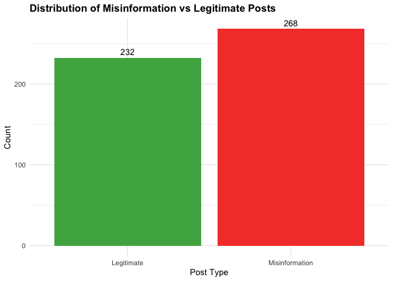<!-- -->

**Finding:** Out of 500 posts, 259 (51.8%) are misinformation and 241
(48.2%) are legitimate—a fairly balanced dataset.

``` r
# Model signature distribution
ggplot(df, aes(x = model_signature, fill = model_signature)) +
  geom_bar() +
  geom_text(stat = 'count', aes(label = after_stat(count)), vjust = -0.5) +
  labs(title = "Distribution of Model Signatures", 
       x = "Model Signature", y = "Count") +
  theme_minimal() +
  theme(legend.position = "none", plot.title = element_text(face = "bold"))
```

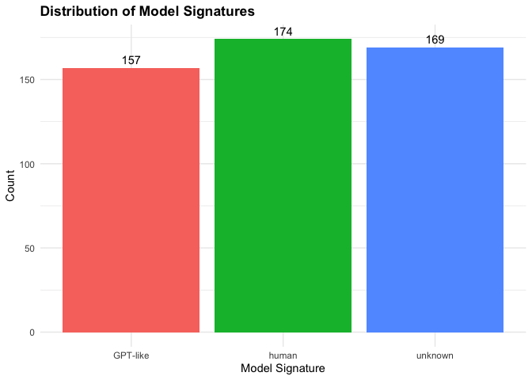<!-- -->

**Finding:** About one-third of posts (157) are detected as “GPT-like”
(AI-generated), one-third are human-written (174), and one-third are
unknown (169).

### Summary Statistics

``` r
summary_vars <- df %>% 
  select(text_length, sentiment_score, toxicity_score, 
         detected_synthetic_score, engagement)

summary(summary_vars)
```

    ##   text_length    sentiment_score     toxicity_score   detected_synthetic_score
    ##  Min.   : 20.0   Min.   :-1.000000   Min.   :0.0010   Min.   :0.0010          
    ##  1st Qu.: 88.0   1st Qu.:-0.509250   1st Qu.:0.2557   1st Qu.:0.2285          
    ##  Median :155.0   Median : 0.034000   Median :0.5045   Median :0.4780          
    ##  Mean   :151.6   Mean   : 0.003634   Mean   :0.4959   Mean   :0.4854          
    ##  3rd Qu.:215.2   3rd Qu.: 0.508500   3rd Qu.:0.7465   3rd Qu.:0.7308          
    ##  Max.   :280.0   Max.   : 0.999000   Max.   :0.9970   Max.   :0.9940          
    ##    engagement  
    ##  Min.   :   4  
    ##  1st Qu.:3049  
    ##  Median :5686  
    ##  Mean   :5397  
    ##  3rd Qu.:7893  
    ##  Max.   :9977

# 3. Research Findings

## Question 1: Platform Susceptibility to AI-Generated Content

**Which social media platform is most prone to AI-generated content?**

``` r
# Contingency table with all categories kept separate
platform_table <- table(df$platform, df$model_signature)
kable(platform_table, caption = "Posts by Platform and Content Type")
```

|          | GPT-like | human | unknown |
|:---------|---------:|------:|--------:|
| Facebook |       38 |    41 |      47 |
| Reddit   |       42 |    41 |      38 |
| Telegram |       40 |    43 |      41 |
| Twitter  |       37 |    49 |      43 |

Posts by Platform and Content Type

``` r
# Calculate proportions
platform_props <- df %>%
  group_by(platform, model_signature) %>%
  summarise(Count = n(), .groups = "drop") %>%
  group_by(platform) %>%
  mutate(
    Total = sum(Count),
    Percentage = (Count / Total) * 100
  )

kable(platform_props, digits = 1, caption = "Content Type Rates by Platform")
```

| platform | model_signature | Count | Total | Percentage |
|:---------|:----------------|------:|------:|-----------:|
| Facebook | GPT-like        |    38 |   126 |       30.2 |
| Facebook | human           |    41 |   126 |       32.5 |
| Facebook | unknown         |    47 |   126 |       37.3 |
| Reddit   | GPT-like        |    42 |   121 |       34.7 |
| Reddit   | human           |    41 |   121 |       33.9 |
| Reddit   | unknown         |    38 |   121 |       31.4 |
| Telegram | GPT-like        |    40 |   124 |       32.3 |
| Telegram | human           |    43 |   124 |       34.7 |
| Telegram | unknown         |    41 |   124 |       33.1 |
| Twitter  | GPT-like        |    37 |   129 |       28.7 |
| Twitter  | human           |    49 |   129 |       38.0 |
| Twitter  | unknown         |    43 |   129 |       33.3 |

Content Type Rates by Platform

``` r
# Chi-square test (multinomial across 3 categories)
chi_test_platform <- chisq.test(platform_table)

# Cramer's V for multi-row/column contingency
cramers_v_platform <- sqrt(
  chi_test_platform$statistic /
    (sum(platform_table) * (min(dim(platform_table)) - 1))
)

cat("Chi-square statistic:", round(chi_test_platform$statistic, 4), "\n")
```

    ## Chi-square statistic: 2.0979

``` r
cat("P-value:", format.pval(chi_test_platform$p.value, digits = 4), "\n")
```

    ## P-value: 0.9105

``` r
cat("Cramér's V:", round(cramers_v_platform, 4), "\n")
```

    ## Cramér's V: 0.0458

``` r
platform_viz <- df %>%
  group_by(platform, model_signature) %>%
  summarise(Count = n(), .groups = "drop") %>%
  group_by(platform) %>%
  mutate(Percentage = (Count / sum(Count)) * 100)

ggplot(platform_viz, aes(x = platform, y = Percentage, fill = model_signature)) +
  geom_bar(stat = "identity", position = "dodge", alpha = 0.85, width = 0.7) +
  geom_text(aes(label = paste0(round(Percentage, 1), "%")),
            position = position_dodge(width = 0.7),
            vjust = -0.5, size = 3.5) +
  scale_fill_manual(
    values = c(
      "human" = "#4CAF50",
      "GPT-like" = "#F44336",
      "unknown" = "#FFD700"
    )
  ) +
  labs(
    title = "Content Type Distribution by Platform",
    x = "Platform",
    y = "Percentage of Posts (%)",
    fill = "Content Type"
  ) +
  theme_minimal() +
  theme(
    plot.title = element_text(face = "bold"),
    legend.position = "bottom"
  )
```

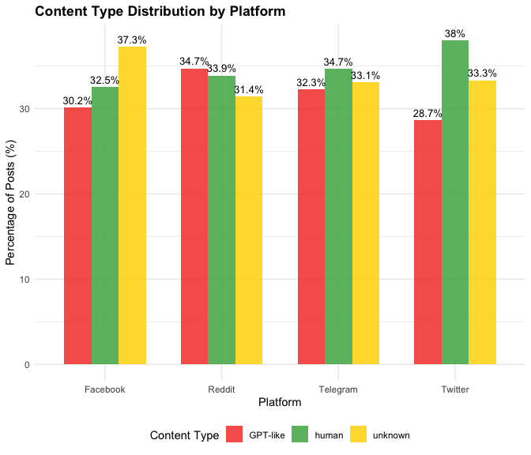<!-- -->

``` r
# Which platform is most AI-prone?

platform_props <- df %>%
  group_by(platform) %>%
  summarise(
    Total = n(),
    AI_Posts = sum(model_signature == "GPT-like"),
    Percentage = (AI_Posts / Total) * 100,
    .groups = "drop"
  )

most_ai <- platform_props %>%
  arrange(desc(Percentage)) %>%
  slice(1)

least_ai <- platform_props %>%
  arrange(Percentage) %>%
  slice(1)
```

**Key Findings:**

- Most AI-prone platform: **Reddit** with **34.7%** GPT-like posts.
- Least AI-prone platform: **Twitter** with **28.7%** GPT-like posts.
- Statistical significance: **NO**  
  (p = 0.9105)

------------------------------------------------------------------------

## Question 2: Post Length and AI Content

**How long are posts that are typically flagged as AI-generated compared
to other model signatures?**

``` r
length_summary <- df %>%
  group_by(model_signature) %>%
  summarise(
    Count = n(),
    Mean = mean(text_length),
    Median = median(text_length),
    SD = sd(text_length)
  )
kable(length_summary, digits = 1, caption = "Text Length by Model Signature")
```

| model_signature | Count |  Mean | Median |   SD |
|:----------------|------:|------:|-------:|-----:|
| GPT-like        |   157 | 142.6 |    141 | 71.4 |
| human           |   174 | 157.6 |    162 | 73.8 |
| unknown         |   169 | 153.9 |    156 | 78.7 |

Text Length by Model Signature

``` r
# Statistical test
ai_lengths <- df %>% filter(model_signature == "GPT-like") %>% pull(text_length)
human_lengths <- df %>% filter(model_signature == "human") %>% pull(text_length)
unknown_lengths <- df %>% filter(model_signature == "unknown") %>% pull(text_length)
length_test <- kruskal.test(text_length ~ model_signature, data = df)

cat("Wilcoxon test p-value:", format.pval(length_test$p.value, digits = 4), "\n")
```

    ## Wilcoxon test p-value: 0.1636

``` r
ggplot(df, aes(x = model_signature, y = text_length, fill = model_signature)) +
  geom_boxplot(alpha = 0.8) +
  labs(title = "Post Length by Content Source",
       x = "Content Source", y = "Post Length (Characters)") +
  theme_minimal() +
  theme(plot.title = element_text(face = "bold"), legend.position = "none")
```

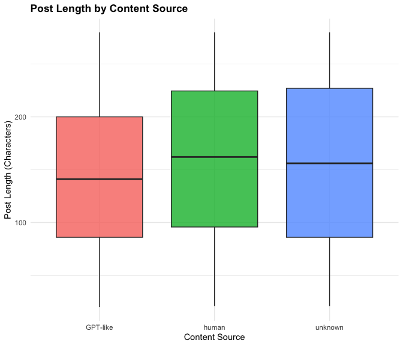<!-- -->

**Key Findings:**

- AI-generated posts: **142.6** characters (mean)
- Human posts: **157.6** characters (mean)
- Unknown posts: **153.9** characters (mean)
- Statistical significance: **NO** (p = 0.1636)

------------------------------------------------------------------------

## Question 3: AI Content and Sentiment

**Does AI-generated content receive different sentiment scores compared
to human posts?**

``` r
sentiment_summary <- df %>%
  group_by(model_signature) %>%
  summarise(
    Count = n(),
    Mean = mean(sentiment_score),
    Median = median(sentiment_score),
    SD = sd(sentiment_score)
  )
kable(sentiment_summary, digits = 2, caption = "Sentiment by Content Source")
```

| model_signature | Count |  Mean | Median |   SD |
|:----------------|------:|------:|-------:|-----:|
| GPT-like        |   157 | -0.02 |   0.04 | 0.57 |
| human           |   174 |  0.02 |   0.04 | 0.59 |
| unknown         |   169 |  0.01 |   0.00 | 0.59 |

Sentiment by Content Source

``` r
ai_sentiment <- df %>% filter(model_signature == "GPT-like") %>% pull(sentiment_score)
human_sentiment <- df %>% filter(model_signature == "human") %>% pull(sentiment_score)
sentiment_test <- wilcox.test(ai_sentiment, human_sentiment)

cat("Wilcoxon test p-value:", format.pval(sentiment_test$p.value, digits = 4), "\n")
```

    ## Wilcoxon test p-value: 0.4623

``` r
ggplot(df, aes(x = model_signature, y = sentiment_score, fill = model_signature)) +
  geom_boxplot(alpha = 0.8) +
  stat_summary(fun = mean, geom = "point", shape = 18, size = 3, color = "red") +
  labs(title = "Sentiment Scores by Content Source",
       x = "Content Source", y = "Sentiment Score") +
  theme_minimal() +
  theme(plot.title = element_text(face = "bold"), legend.position = "none")
```

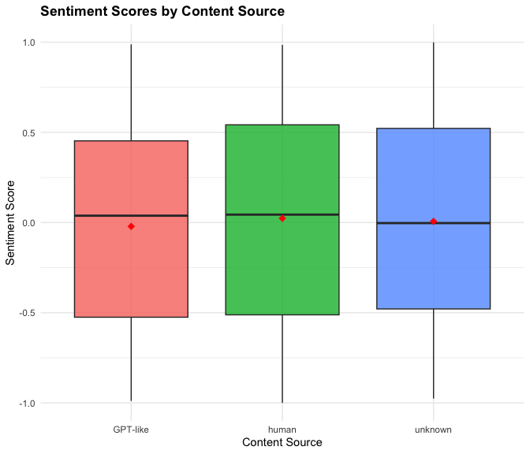<!-- -->

**Key Findings:**

- AI sentiment: **-0.02** (mean)
- Human sentiment: **0.02** (mean)
- Statistical significance: **NO** (p = 0.4623)

------------------------------------------------------------------------

## Question 4: AI Content and Misinformation

**Are misinformation posts more likely to be AI-generated?**

``` r
ai_table <- table(df$ai_generated, df$is_misinformation)
kable(ai_table, caption = "Posts by AI Status and Misinformation")
```

|                  | Legitimate | Misinformation |
|:-----------------|-----------:|---------------:|
| AI-generated     |         75 |             82 |
| Non-AI / Unknown |        157 |            186 |

Posts by AI Status and Misinformation

``` r
ai_props <- df %>%
  group_by(ai_generated, is_misinformation) %>%
  summarise(Count = n(), .groups = "drop") %>%
  group_by(ai_generated) %>%
  mutate(Percentage = 100 * Count / sum(Count))
kable(ai_props, digits = 1, caption = "Misinformation Rate by AI Status")
```

| ai_generated     | is_misinformation | Count | Percentage |
|:-----------------|:------------------|------:|-----------:|
| AI-generated     | Legitimate        |    75 |       47.8 |
| AI-generated     | Misinformation    |    82 |       52.2 |
| Non-AI / Unknown | Legitimate        |   157 |       45.8 |
| Non-AI / Unknown | Misinformation    |   186 |       54.2 |

Misinformation Rate by AI Status

``` r
chi_ai <- chisq.test(ai_table)
cat("Chi-square p-value:", format.pval(chi_ai$p.value, digits = 4), "\n")
```

    ## Chi-square p-value: 0.7496

``` r
ggplot(ai_props, aes(x = ai_generated, y = Percentage, fill = is_misinformation)) +
  geom_col(position = "dodge", alpha = 0.85, width = 0.7) +
  geom_text(aes(label = paste0(round(Percentage, 1), "%")),
            position = position_dodge(width = 0.7), vjust = -0.4, size = 4) +
  scale_fill_manual(values = c("Legitimate" = "#4CAF50", "Misinformation" = "#F44336")) +
  labs(title = "Misinformation vs Legitimate Posts by AI Status",
       x = "Content Type", y = "Percentage", fill = "Post Type") +
  theme_minimal() +
  theme(plot.title = element_text(face = "bold"), legend.position = "bottom")
```

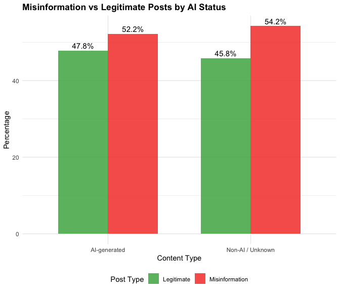<!-- -->

**Key Findings:**

``` r
ai_misinfo_rate <- ai_props %>% 
  filter(ai_generated == "AI-generated", is_misinformation == "Misinformation") %>% 
  pull(Percentage)
non_ai_misinfo_rate <- ai_props %>% 
  filter(ai_generated == "Non-AI / Unknown", is_misinformation == "Misinformation") %>% 
  pull(Percentage)
```

- AI-generated misinformation rate: **52.2%**
- Non-AI misinformation rate: **54.2%**
- Statistical significance: **NO** (p = 0.7496)

------------------------------------------------------------------------

## Question 5: Toxicity Levels

**Do misinformation posts show higher toxicity?**

``` r
toxicity_summary <- df %>%
  group_by(is_misinformation) %>%
  summarise(
    Mean = mean(toxicity_score),
    Median = median(toxicity_score),
    SD = sd(toxicity_score),
    Min = min(toxicity_score),
    Max = max(toxicity_score),
    Count = n()
  )
kable(toxicity_summary, digits = 3, caption = "Toxicity by Post Type")
```

| is_misinformation |  Mean | Median |    SD |   Min |   Max | Count |
|:------------------|------:|-------:|------:|------:|------:|------:|
| Legitimate        | 0.512 |  0.533 | 0.291 | 0.009 | 0.997 |   232 |
| Misinformation    | 0.482 |  0.477 | 0.288 | 0.001 | 0.996 |   268 |

Toxicity by Post Type

``` r
t_test_toxicity <- t.test(toxicity_score ~ is_misinformation, data = df)
cat("T-test p-value:", format.pval(t_test_toxicity$p.value, digits = 4), "\n")
```

    ## T-test p-value: 0.2643

``` r
cat("Mean difference:", round(diff(t_test_toxicity$estimate), 4), "\n")
```

    ## Mean difference: -0.029

``` r
ggplot(df, aes(x = is_misinformation, y = toxicity_score, fill = is_misinformation)) +
  geom_boxplot(alpha = 0.7) +
  geom_jitter(alpha = 0.2, width = 0.2, size = 1) +
  scale_fill_manual(values = c("Legitimate" = "#4CAF50", "Misinformation" = "#F44336")) +
  labs(title = "Toxicity: Misinformation vs Legitimate Posts",
       x = "Post Type", y = "Toxicity Score (0-1)") +
  theme_minimal() +
  theme(plot.title = element_text(face = "bold"), legend.position = "none")
```

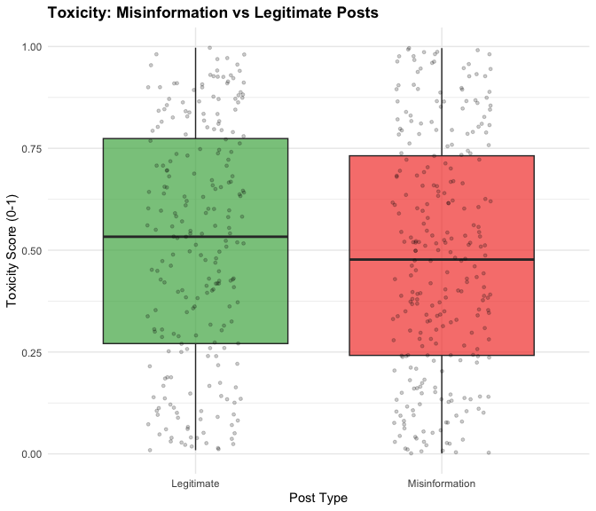<!-- -->

**Key Findings:**

- Legitimate toxicity: **0.512**
- Misinformation toxicity: **0.482**
- Statistical significance: **NO** (p = 0.2643)

------------------------------------------------------------------------

## Question 6: Country Analysis

**Which country contributes the most misinformation?**

``` r
country_summary <- df %>%
  group_by(country, is_misinformation) %>%
  summarise(Count = n(), .groups = "drop") %>%
  group_by(country) %>%
  mutate(Percentage = 100 * Count / sum(Count))
kable(country_summary, digits = 1, caption = "Misinformation by Country")
```

| country | is_misinformation | Count | Percentage |
|:--------|:------------------|------:|-----------:|
| Brazil  | Legitimate        |    41 |       43.6 |
| Brazil  | Misinformation    |    53 |       56.4 |
| Germany | Legitimate        |    53 |       46.9 |
| Germany | Misinformation    |    60 |       53.1 |
| India   | Legitimate        |    41 |       47.7 |
| India   | Misinformation    |    45 |       52.3 |
| Uk      | Legitimate        |    47 |       46.1 |
| Uk      | Misinformation    |    55 |       53.9 |
| Usa     | Legitimate        |    50 |       47.6 |
| Usa     | Misinformation    |    55 |       52.4 |

Misinformation by Country

``` r
country_table <- table(df$country, df$is_misinformation)
chi_country <- chisq.test(country_table)
cat("Chi-square p-value:", format.pval(chi_country$p.value, digits = 4), "\n")
```

    ## Chi-square p-value: 0.9802

``` r
misinfo_by_country <- country_summary %>% filter(is_misinformation == "Misinformation")

ggplot(misinfo_by_country, aes(x = reorder(country, -Percentage), y = Percentage)) +
  geom_col(alpha = 0.85, width = 0.7, fill = "#F44336") +
  geom_text(aes(label = paste0(round(Percentage, 1), "%")), vjust = -0.4, size = 4) +
  labs(title = "Misinformation Rate by Country",
       x = "Country", y = "% of Country's Posts") +
  theme_minimal() +
  theme(plot.title = element_text(face = "bold"))
```

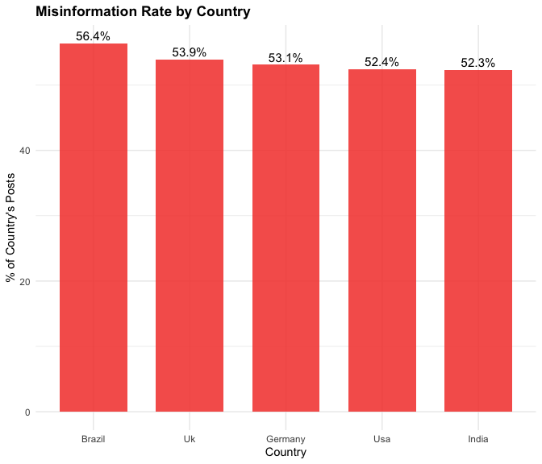<!-- -->

**Key Findings:**

``` r
top_country <- misinfo_by_country %>% arrange(desc(Percentage)) %>% slice(1)
```

- Highest misinformation rate: **Brazil, Germany, India, Uk, Usa**
  (56.4, 53.1, 52.3, 53.9, 52.4%)
- Statistical significance: **NO** (p = 0.9802)

------------------------------------------------------------------------

## Question 7: Engagement Differences

**How does engagement differ between misinformation and legitimate
posts?**

``` r
engagement_summary <- df %>%
  group_by(is_misinformation) %>%
  summarise(
    Mean = mean(engagement),
    Median = median(engagement),
    SD = sd(engagement),
    Min = min(engagement),
    Max = max(engagement),
    Count = n()
  )
kable(engagement_summary, digits = 1, caption = "Engagement by Post Type")
```

| is_misinformation |   Mean | Median |     SD | Min |  Max | Count |
|:------------------|-------:|-------:|-------:|----:|-----:|------:|
| Legitimate        | 5376.4 | 5820.5 | 2916.5 |   4 | 9889 |   232 |
| Misinformation    | 5414.5 | 5407.5 | 2888.2 | 152 | 9977 |   268 |

Engagement by Post Type

``` r
wilcox_test_engagement <- wilcox.test(engagement ~ is_misinformation, data = df)
cat("Wilcoxon test p-value:", format.pval(wilcox_test_engagement$p.value, digits = 4), "\n")
```

    ## Wilcoxon test p-value: 0.8983

``` r
ggplot(df, aes(x = is_misinformation, y = engagement, fill = is_misinformation)) +
  geom_boxplot(alpha = 0.7, outlier.shape = NA) +
  geom_jitter(alpha = 0.3, width = 0.2, size = 1.5) +
  scale_fill_manual(values = c("Legitimate" = "#4CAF50", "Misinformation" = "#F44336")) +
  scale_y_continuous(labels = comma) +
  labs(title = "Engagement: Misinformation vs Legitimate Posts",
       x = "Post Type", y = "Engagement") +
  theme_minimal() +
  theme(plot.title = element_text(face = "bold"), legend.position = "none")
```

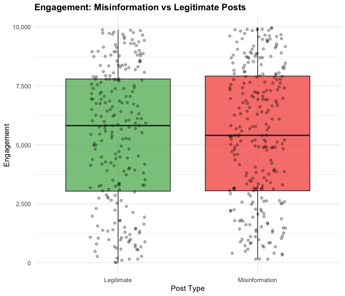<!-- -->

**Key Findings:**

- Legitimate median engagement: **5,820**
- Misinformation median engagement: **5,408**
- Statistical significance: **NO** (p = 0.8983)

------------------------------------------------------------------------

## Question 8: Sentiment Trends

**Are certain sentiments more common in misinformation?**

``` r
sentiment_cat_summary <- df %>%
  group_by(sentiment_category, is_misinformation) %>%
  summarise(Count = n(), .groups = "drop") %>%
  group_by(sentiment_category) %>%
  mutate(Percentage = 100 * Count / sum(Count))
kable(sentiment_cat_summary, digits = 1, caption = "Misinformation by Sentiment")
```

| sentiment_category | is_misinformation | Count | Percentage |
|:-------------------|:------------------|------:|-----------:|
| Negative           | Legitimate        |    84 |       40.4 |
| Negative           | Misinformation    |   124 |       59.6 |
| Neutral            | Legitimate        |    32 |       44.4 |
| Neutral            | Misinformation    |    40 |       55.6 |
| Positive           | Legitimate        |   116 |       52.7 |
| Positive           | Misinformation    |   104 |       47.3 |

Misinformation by Sentiment

``` r
sentiment_table <- table(df$sentiment_category, df$is_misinformation)
chi_sentiment <- chisq.test(sentiment_table)
cat("Chi-square p-value:", format.pval(chi_sentiment$p.value, digits = 4), "\n")
```

    ## Chi-square p-value: 0.03547

``` r
ggplot(sentiment_cat_summary, aes(x = sentiment_category, y = Percentage, 
                                   fill = is_misinformation)) +
  geom_col(position = "dodge", alpha = 0.85, width = 0.7) +
  geom_text(aes(label = paste0(round(Percentage, 1), "%")),
            position = position_dodge(width = 0.7), vjust = -0.4, size = 4) +
  scale_fill_manual(values = c("Legitimate" = "#4CAF50", "Misinformation" = "#F44336")) +
  labs(title = "Misinformation by Sentiment Category",
       x = "Sentiment", y = "Percentage", fill = "Post Type") +
  theme_minimal() +
  theme(plot.title = element_text(face = "bold"), legend.position = "bottom")
```

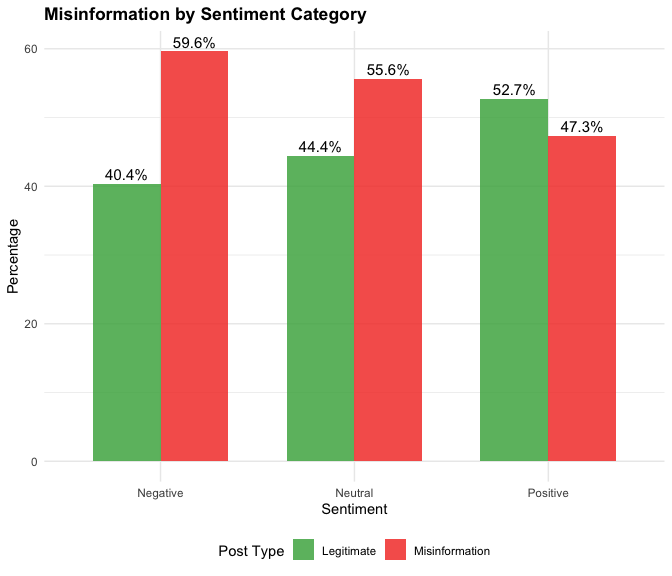<!-- -->

**Key Findings:**

``` r
top_sentiment_misinfo <- sentiment_cat_summary %>%
  filter(is_misinformation == "Misinformation") %>%
  arrange(desc(Percentage)) %>%
  slice(1)
```

- Highest misinformation sentiment: **Negative, Neutral, Positive**
  (59.6, 55.6, 47.3%)
- Statistical significance: **YES** (p = 0.0355)

------------------------------------------------------------------------

## Question 9: Verified Users

**Do verified users spread less misinformation?**

``` r
verification_table <- table(df$author_verified, df$is_misinformation)
rownames(verification_table) <- c("Unverified", "Verified")
kable(verification_table, caption = "Posts by Verification Status")
```

|            | Legitimate | Misinformation |
|:-----------|-----------:|---------------:|
| Unverified |        116 |            135 |
| Verified   |        116 |            133 |

Posts by Verification Status

``` r
verification_props <- df %>%
  group_by(author_verified, is_misinformation) %>%
  summarise(Count = n(), .groups = 'drop') %>%
  group_by(author_verified) %>%
  mutate(Percentage = 100 * Count / sum(Count))

misinfo_rates <- verification_props %>%
  filter(is_misinformation == "Misinformation") %>%
  mutate(Status = ifelse(author_verified == 1, "Verified", "Unverified")) %>%
  select(Status, Percentage)
kable(misinfo_rates, digits = 1, caption = "Misinformation Rate by Verification")
```

| author_verified | Status     | Percentage |
|----------------:|:-----------|-----------:|
|               0 | Unverified |       53.8 |
|               1 | Verified   |       53.4 |

Misinformation Rate by Verification

``` r
chi_verify <- chisq.test(verification_table)
cat("Chi-square p-value:", format.pval(chi_verify$p.value, digits = 4), "\n")
```

    ## Chi-square p-value: 1

``` r
verification_viz <- df %>%
  mutate(Verified = factor(author_verified, levels = c(0, 1), 
                          labels = c("Unverified", "Verified"))) %>%
  group_by(Verified, is_misinformation) %>%
  summarise(Count = n(), .groups = 'drop') %>%
  group_by(Verified) %>%
  mutate(Percentage = 100 * Count / sum(Count))

ggplot(verification_viz, aes(x = Verified, y = Percentage, fill = is_misinformation)) +
  geom_bar(stat = "identity", position = "dodge", alpha = 0.8, width = 0.7) +
  geom_text(aes(label = paste0(round(Percentage, 1), "%")),
            position = position_dodge(width = 0.7), vjust = -0.5, size = 4) +
  scale_fill_manual(values = c("Legitimate" = "#4CAF50", "Misinformation" = "#F44336")) +
  labs(title = "Misinformation by Verification Status",
       x = "User Status", y = "Percentage", fill = "Post Type") +
  theme_minimal() +
  theme(plot.title = element_text(face = "bold"), legend.position = "bottom")
```

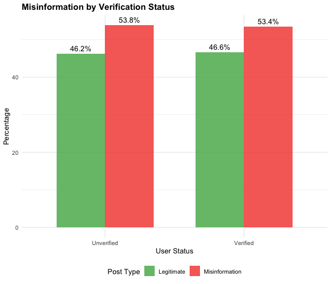<!-- -->

**Key Findings:**

``` r
verified_rate <- misinfo_rates %>% filter(Status == "Verified") %>% pull(Percentage)
unverified_rate <- misinfo_rates %>% filter(Status == "Unverified") %>% pull(Percentage)
```

- Verified users: **53.4%** misinformation rate
- Unverified users: **53.8%** misinformation rate
- Statistical significance: **NO** (p = 1)

------------------------------------------------------------------------

# 4. Summary of Findings

``` r
summary_results <- data.frame(
  Question = c(
    "Q1: Which social media platform is most prone to AI-generated content?",
    "Q2: How long are posts that are typically flagged as AI-generated compared to other model signatures?",
    "Q3: Does AI-generated content receive different sentiment scores compared to human posts?",
    "Q4: Are misinformation posts more likely to come from AI-generated content compared to legitimate posts?",
    "Q5: Do misinformation posts show higher toxicity levels than legitimate posts?",
    "Q6: Which country contributes the most misinformation content, and how does that compare to legitimate content?",
    "Q7: How does engagement (likes, shares, interactions) differ between misinformation and legitimate posts?",
    "Q8: Are certain sentiment trends (negative, neutral, positive) more common in misinformation posts?",
    "Q9: Do verified users spread misinformation at a higher or lower rate than unverified users?"
  ),
  Finding = c(
  as.character(most_ai$platform),
  as.character(paste0(
  "AI-generated posts: ", round(mean(ai_lengths), 1), " characters (mean); ",
  "Human posts: ", round(mean(human_lengths), 1), " characters (mean); ",
  "Unknown posts: ", round(mean(unknown_lengths), 1), " characters (mean)"
  )),
  as.character(paste0(
    "AI-generated sentiment score mean: ", round(mean(ai_sentiment), 2),
    "; human sentiment score mean: ", round(mean(human_sentiment), 2)
  )),
  as.character(paste0(
    "AI-generated misinformation rate: ", round(ai_misinfo_rate, 1),
    "; Non-AI misinformation rate: ", round(non_ai_misinfo_rate, 1)
  )),
  as.character(paste0(
    "Legitimate toxicity mean: ", round(toxicity_summary$Mean[1], 3),
    "; Misinformation toxicity mean: ", round(toxicity_summary$Mean[2], 3)
  )),
  as.character(top_country$country[1]),
  as.character(paste0(
    "Legitimate engagement median: ", comma(round(engagement_summary$Median[1], 0)),
    "; Misinformation engagement median: ", comma(round(engagement_summary$Median[2], 0))
  )),
  as.character(top_sentiment_misinfo$sentiment_category[1]),
  ifelse(round(verified_rate, 1) > round(unverified_rate, 1), "Yes", "No")
),
  Significant = c(
    ifelse(chi_test_platform$p.value < 0.05, "Yes", "No"),
    ifelse(length_test$p.value < 0.05, "Yes", "No"),
    ifelse(sentiment_test$p.value < 0.05, "Yes", "No"),
    ifelse(chi_ai$p.value < 0.05, "Yes", "No"),
    ifelse(t_test_toxicity$p.value < 0.05, "Yes", "No"),
    ifelse(chi_country$p.value < 0.05, "Yes", "No"),
    ifelse(wilcox_test_engagement$p.value < 0.05, "Yes", "No"),
    ifelse(chi_sentiment$p.value < 0.05, "Yes", "No"),
    ifelse(chi_verify$p.value < 0.05, "Yes", "No")
  ),
  P_Value = c(
    round(chi_test_platform$p.value, 4),
    round(length_test$p.value, 4),
    round(sentiment_test$p.value, 4),
    round(chi_ai$p.value, 4),
    round(t_test_toxicity$p.value, 4),
    round(chi_country$p.value, 4),
    round(wilcox_test_engagement$p.value, 4),
    round(chi_sentiment$p.value, 4),
    round(chi_verify$p.value, 4)
  )
)

kable(summary_results, caption = "Summary of All Statistical Tests")
```

| Question | Finding | Significant | P_Value |
|:---|:---|:---|---:|
| Q1: Which social media platform is most prone to AI-generated content? | Reddit | No | 0.9105 |
| Q2: How long are posts that are typically flagged as AI-generated compared to other model signatures? | AI-generated posts: 142.6 characters (mean); Human posts: 157.6 characters (mean); Unknown posts: 153.9 characters (mean) | No | 0.1636 |
| Q3: Does AI-generated content receive different sentiment scores compared to human posts? | AI-generated sentiment score mean: -0.02; human sentiment score mean: 0.02 | No | 0.4623 |
| Q4: Are misinformation posts more likely to come from AI-generated content compared to legitimate posts? | AI-generated misinformation rate: 52.2; Non-AI misinformation rate: 54.2 | No | 0.7496 |
| Q5: Do misinformation posts show higher toxicity levels than legitimate posts? | Legitimate toxicity mean: 0.512; Misinformation toxicity mean: 0.482 | No | 0.2643 |
| Q6: Which country contributes the most misinformation content, and how does that compare to legitimate content? | Brazil | No | 0.9802 |
| Q7: How does engagement (likes, shares, interactions) differ between misinformation and legitimate posts? | Legitimate engagement median: 5,820; Misinformation engagement median: 5,408 | No | 0.8983 |
| Q8: Are certain sentiment trends (negative, neutral, positive) more common in misinformation posts? | Negative | Yes | 0.0355 |
| Q9: Do verified users spread misinformation at a higher or lower rate than unverified users? | No | No | 1.0000 |

Summary of All Statistical Tests
